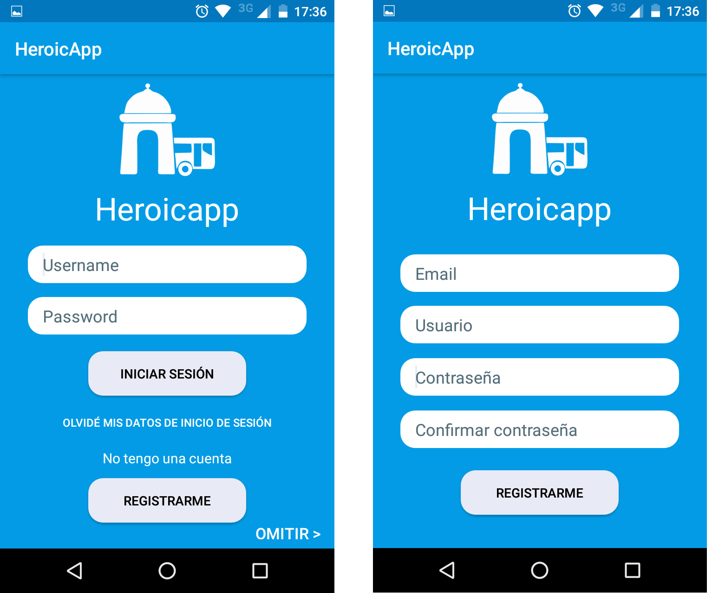
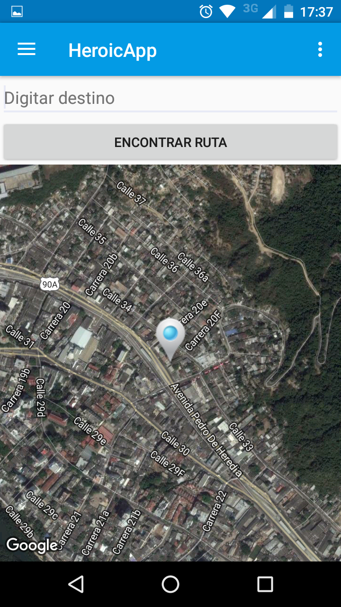
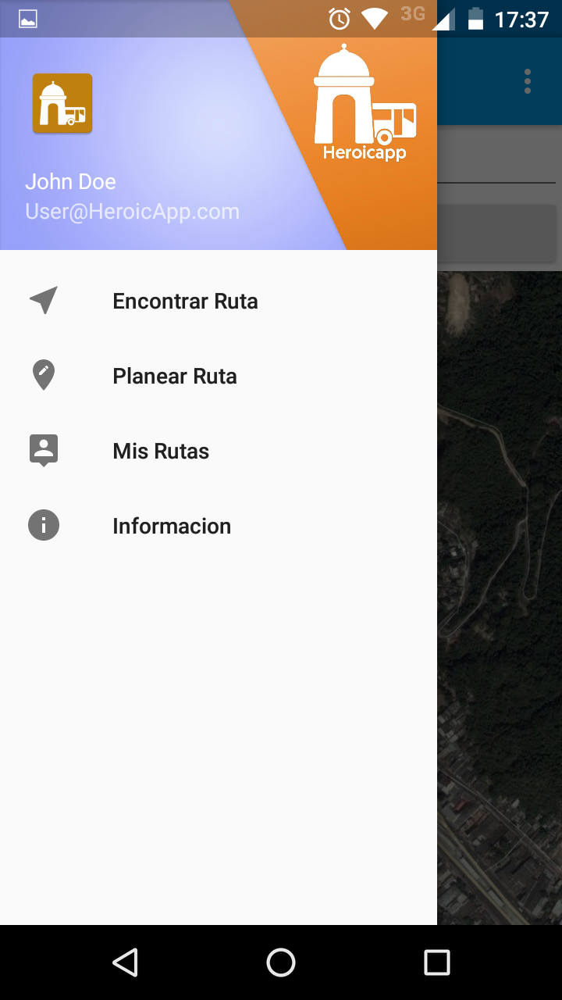

# HeroicApp

Heroicapp es un producto software móvil de carácter informativo dirigido a todos aquellos que deseen moverse por la ciudad de Cartagena de indias utilizando el transporte público, donde se socializa la información correspondiente a las rutas del antiguo y nuevo sistema de transporte público, permitiendo generar grandes beneficios a la movilidad y economía de la ciudad, dándole un mejor uso a los recursos que se encuentran disponibles para los usuarios.   

## Colaboradore(s):

**Joshua Puello** https://github.com/JoshuaPuello

**Juan Tejada**

## Escenarios

    

    

    

